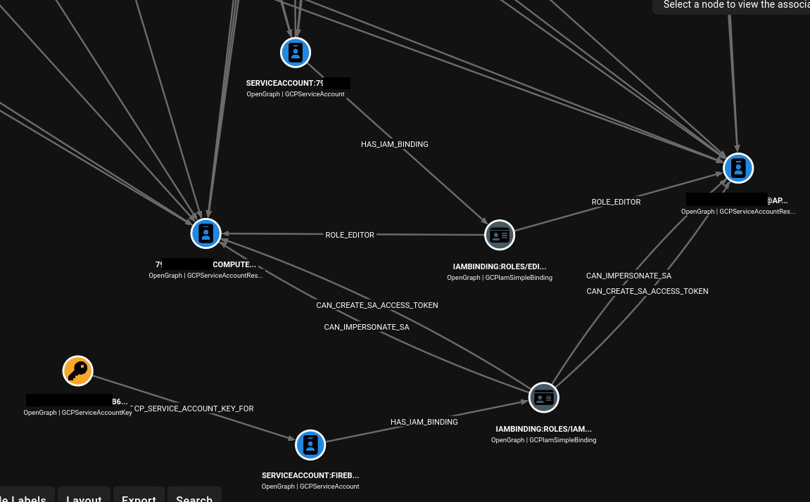

[](https://pypi.org/project/gcpwn/)
[](https://www.python.org/)
[](./LICENSE)
[](https://github.com/NetSPI/gcpwn/stargazers)
[](https://github.com/NetSPI/gcpwn/network)
[](https://github.com/NetSPI/gcpwn/issues)

# GCPwn

## Overview

GCPwn is a Google Cloud offensive security assessment framework focused on workspace-driven credential handling, service enumeration, artifact download, and graph-based attack-path analysis.

The project started as a pentesting-focused "one-stop-shop" to combine:

- broad service enumeration,
- practical exploit workflows,
- saved permission tracking over time,
- and OpenGraph output for BloodHound.

Unlike one-off scripts, GCPwn stores both resource data and discovered actions/permissions while you run modules, which makes follow-on analysis and exploit pathing much faster.

## High-Level Features

- **CLI UX:** Interactive terminal workflow for workspaces, credentials, module execution, and exports.
- **Module Model:** Enumeration, exploit, unauthenticated, and processing modules across many GCP services.
- **Mass Enumeration:** `enum_all` orchestration support (implemented under `modules/everything`).
- **IAM Visibility:** `testIamPermissions` coverage across many resources + policy binding processing.
- **Artifact Downloads:** `--download` support across multiple modules with scoped skip/include behavior.
- **OpenGraph / BloodHound:** Graph generation for GCP principals/resources, privilege-escalation edges, inheritance expansion, and optional conditional evaluation placeholders.
- **Reporting Exports:** SQLite-backed data export to CSV/JSON/Excel/tree image from the CLI.

## Documentation

Documentation is maintained in the GitHub Wiki:

- https://github.com/NetSPI/gcpwn/wiki

Additional project docs:

- Contributing: `CONTRIBUTING.md`
- Roadmap: `ROADMAP.md`

## Installation TLDR

### Option 1: Local Install

```bash
git clone https://github.com/NetSPI/gcpwn.git
cd gcpwn

python3 -m venv .venv
source .venv/bin/activate
pip install --upgrade pip
```

Base install (no `prettytable`, default output is text):

```bash
pip install -r requirements.txt
```

Install optional table output support:

```bash
pip install prettytable==3.17.0
```

Run the tool:

```bash
python -m gcpwn
```

### Option 2: Pip Install (PyPI)

```bash
pip3 install gcpwn
```

If you want pretty tables, optional table rendering dependency `prettytable` can be installed via:

```bash
pip3 install "gcpwn[table]"
```

Run the tool:

```bash
gcpwn
```

If your shell cannot find `gcpwn`, run:

```bash
python -m gcpwn
```

### Option 3: Docker

```bash
docker build -t gcpwn .
docker run --rm -it gcpwn
```

If you want local persistence for DB/output between runs, mount volumes:

```bash
docker run --rm -it \
  -v "$(pwd)/databases:/opt/gcpwn/databases" \
  -v "$(pwd)/gcpwn_output:/opt/gcpwn/gcpwn_output" \
  gcpwn
```

## First-Run TLDR

1. Create/select a workspace.
2. Load credentials (user/service) and set your target project(s).
3. Start with broad enumeration:

```bash
# Common first pass
modules run enum_all --iam

# Deep IAM permission pass at org/folder/project scale
modules run enum_all --iam --all-permissions

# Deep pass + download coverage
modules run enum_all --iam --all-permissions --download
```

4. Review what was collected:

```bash
# See your current creds (includes testIamPermission references)
creds info

# Process all IAM bindings & get IAM summary
modules run process_iam_bindings

# Create BloodHound graph of IAM permissions
modules run enum_gcp_cloud_hound_data --out output.json

# Export all enumerated data to an excel sheet
data export excel
```

## Unauthenticated Passthrough Mode

You can run unauthenticated modules directly without entering the interactive workspace shell. This creates a workspace called `PASSTHROUGH` implicitly.

Examples:

```bash
# Run via installed console script
gcpwn --module unauth_apikey_enum_all_scopes --api-key AIza...

# Same flow via python module entrypoint
python -m gcpwn --module unauth_apikey_gemini_exploit --api-key AIza...

# Modules that derive targets from project context can use --project-id
python -m gcpwn --module unauth_functionbrute --project-id my-project --region us-central1
```

Notes:

- In passthrough mode, **all** commands use `--module <module_name>` (regardless of `gcpwn` vs `python -m gcpwn` entrypoint).
- Passthrough mode is currently limited to `Unauthenticated` modules.
- This mode skips workspace selection/startup and uses a lightweight runtime context.
- Pass module-specific help with: `gcpwn --module <module> -h`
- Use normal interactive mode (`gcpwn` then `modules run ...`) when you want workspace-backed caching, credential management, and full data persistence.

## OpenGraph TLDR

By default the OpenGraph module ONLY graphs edges and related resource edges that are tied to privilege escalatoin paths. This default allowlist of OpenGraph escalation rules live in `gcpwn/mappings/og_privilege_escalation_paths.json`. You can enable differnet flags. See below for differnet flags. In general the following is probably good in most cases:
```bash
# TLDR best option
modules run enum_gcp_cloud_hound_data --expand-inheritance --reset --out Bloodhound_Output.json
```

### Graphing Strategy

You might notice edges go to `role@location` instead of going directly to the project. This preserves authorization fidelity in the graph. If User A has `compute.admin` on Project A and User B has `storage.admin` on Project A, drawing both users directly to Project A and then Project A to all resources would incorrectly imply both users can reach the same resources. The correct model is to route each user through their specific role binding node at that location, and only then fan out to resources that role can actually affect.

Incorrect method (over-broad reach):

```text
User A --> Project A --> Compute & Storage
User B --> Project A --> Compute & Storage
```

Correct method (binding-scoped reach):

```text
User A --> compute_admin@project:A --> Compute Resources
User B --> storage_admin@project:A --> Storage Resources
```



Generate OpenGraph JSON:

```bash
modules run enum_gcp_cloud_hound_data --out opengraph_output.json --reset [--include-all] [--expand-inherited] [--cond-eval]

# Example
(<project-id>:example-cred)> modules run enum_gcp_cloud_hound_data --out TEST.json
[*] Step 1: users_groups (Users/Groups graph)
[*] Completed users_groups: +92 nodes, +0 edges
[*] Step 2: iam_bindings (IAM bindings graph)
[*] Completed iam_bindings: +77 nodes, +179 edges
[*] Step 3: inferred_permissions (Inferred permissions graph)
[*] Completed inferred_permissions: +69 nodes, +117 edges
[*] Step 4: resource_expansion (Resource expansion graph)
[*] Completed resource_expansion: +66 nodes, +71 edges
[*] Pruned isolated service-account IAM-binding islands (pairs=15, key_islands=2, nodes=39, edges=22).
[*] Pruned orphan implied-IAM-binding nodes (implied_bindings=15, nodes=15, edges=15).
[*] Pruned isolated service-account nodes (service_accounts=43, nodes=43, edges=0).
[*] OpenGraph generation complete. Nodes: 207 | Edges: 330
[*] Saved graph JSON to TEST.json

# Pass the TEST.json into your local installation of Bloodhound
> head TEST.json -n 20
{
  "metadata": {
    "source_kind": "GCPBase"
  },
  "graph": {
    "nodes": [
      {
        "id": "allUsers",
        "kinds": [
          "GCPAllUsers",
          "GCPPrincipal"
        ],
        "properties": {
          "display_name": "allUsers",
          "source": "iam_members"
        }
      },
      {
        "id": "combo_iambinding:RESET_COMPUTE_STARTUP_SA@project:<Project_ID>#06e0003fe1",
        "kinds": [
      [TRUNCATED]

```

Optional flags:

- `--include-all`: include broader relationship output that might not be "direct priv escalations" (ex. a binding that lets you read bucket content).
- `--expand-inherited`: expand inherited IAM scope relationships.
- `--cond-eval`: currently preserves conditional workflow plumbing (placeholder behavior).
- `--reset`: clear prior OpenGraph DB state before generation.

Then import the JSON into BloodHound CE.

### Adding Your Own Edges TLDR

If you want to add your own priv escalation (or any edges really) to be called out "by default", Just edit `og_privilege_escalation_paths.json` and add your edge. You need to know the permissions you want to flag on. We cover adding a single permission edge below, but we support multi-permission edges as described in the wiki. 

#### Add a Single-Permission Edge

Let's assume we want to call out `cloudkms.cryptoKeys.update` and add it to our default single permission rules. 

1. Add to the permission --> role dictionary
   - If your target permission (i.e. `cloudkms.cryptoKeys.update`) is not already included, add the permission on a newline to `scripts/build_predfined_perm_to_role_input.txt`
   - With your own GCP creds (ex. a free GCP account), run `./build_predefined_perm_to_roles.sh build_predfined_perm_to_role_input.txt > perm_to_role_mappings.json` as an authenticated user. This is a bash script that just gets all permissions for all predefined rules in a GCP env to see what roles map to your permission. You could alos just add it manually to hte existing `gcpwn/data/core/mappings/og_permission_to_roles_map.json` file if you want using https://docs.cloud.google.com/iam/docs/roles-permissions
   - You should see the permission --> role(s) mapping in `perm_to_role_mappings.json`. Replace `gcpwn/data/core/mappings/og_permission_to_roles_map.json` with `perm_to_role_mappings.json`
2. Add a rule definition to `og_privilege_escalation_paths.json` (Note multi-permission rules are covered in the wiki). In our case, it might look like the netry below. Note `resource_scopes_possible` is where one might see a binding with those permisisions, and `resource_types` are the actual resource nodes you will be drawing edges to. For example, you might see `cloudkms.cryptoKeys.update` at the project level or attached directly to a key, but the end edge is going to be drawn to a key (not a project; if attached to a project gcpwn will fan out edges to keys rather than the project node).

```json
"single_permission_rules": {
  "CAN_DISABLE_KMS_KEY": {
    "permission": "cloudkms.cryptoKeys.update",
    "description": "Can update KMS crypto key settings including disabling or changing key behavior.",
    "resource_scopes_possible": ["project", "kmscryptokey"],
    "target_selector": {
      "mode": "resource_types",
      "resource_types": ["kmscryptokey"]
    }
  }
}
```

3. A final OpenGraph edge might then look like the following when ingested in Bloodhound

```text
user:alice@example.com
  -[HAS_IAM_BINDING]->
iambinding:roles/cloudkms.admin@project:my-project
  -[CAN_DISABLE_KMS_KEY]->
resource:projects/my-project/locations/us-central1/keyRings/prod/cryptoKeys/app-key
```

### OpenGraph Cypher TLDR

These examples assume your OpenGraph JSON has already been imported into Neo4j/BloodHound-compatible tooling.

1. See all nodes and edges

```cypher
MATCH (n)-[r]->(m)
RETURN n, r, m
LIMIT 1000
```

2. See all nodes and edges minus service-agent-associated data

```cypher
MATCH (n)-[r]->(m)
WHERE coalesce(n.is_service_agent, false) = false
  AND coalesce(m.is_service_agent, false) = false
  AND coalesce(n.service_agent_role, false) = false
  AND coalesce(m.service_agent_role, false) = false
RETURN n, r, m
LIMIT 1000
```

3. See all nodes and edges where IAM edges are inferred only

```cypher
MATCH (p)-[:HAS_IMPLIED_PERMISSIONS]->(g)-[r]->(t)
WHERE type(r) STARTS WITH "INFERRED_"
RETURN p, g, r, t
LIMIT 1000
```

4. See all nodes and edges where IAM edges are binding-based only

```cypher
MATCH (p)-[seed:HAS_IAM_BINDING|HAS_COMBO_BINDING]->(g)
OPTIONAL MATCH (g)-[r]->(t)
WHERE r IS NULL OR NOT type(r) STARTS WITH "INFERRED_"
RETURN p, seed, g, r, t
LIMIT 1000
```

5. Find paths to `roles/owner` or any custom role (replace `ABC_Name`)

```cypher
MATCH p=(principal)-[:HAS_IAM_BINDING]->(binding:GCPIamSimpleBinding)
WHERE binding.role_name IN ["roles/owner", "ABC_Name"]
OPTIONAL MATCH (binding)-[r]->(target)
RETURN principal, binding, r, target, p
LIMIT 1000
```

6. Identify paths where a service account leads to another service account

```cypher
MATCH p=(sa1:GCPServiceAccount)-[*1..6]->(sa2)
WHERE (sa2:GCPServiceAccount OR sa2:GCPServiceAccountResource)
  AND sa1 <> sa2
RETURN p
LIMIT 500
```

## Module/Data Output TLDR

### Module output format

Default output is `text`. You can switch workspace output format with:

```text
configs list
configs set std_output_format text
configs set std_output_format table
```

`table` mode requires the optional dependency:

```bash
pip install prettytable==3.17.0
```

### Data output and exports

```text
# Export all collected service data to one CSV blob
data export csv

# Export all collected service data to one JSON blob
data export json

# Export all collected service data to one Excel workbook
data export excel

# Export all collected service data to a specific Excel file path
data export excel --out-file ./gcpwn_export.xlsx

# Export hierarchy image (SVG)
data export treeimage

# Run direct SQL against SQLite (service DB by default)
data sql --db service "SELECT * FROM iam_allow_policies LIMIT 25"

# Wipe service DB rows for current workspace (destructive)
data wipe-service --yes
```

## Dependency Inventory

Direct runtime dependencies are sourced from `requirements.txt`.

### Core utilities

- `boto3>=1.34,<2` (includes `botocore` transitively)
- `pandas==3.0.2`
- `requests==2.33.1`
- `xlsxwriter==3.2.9`

### Google API and auth libraries

- `google-api-core==2.30.3`
- `google-api-python-client==2.194.0`
- `google-auth-httplib2==0.3.1`
- `google-auth-oauthlib==1.3.1`

### Google Cloud client libraries

- `google-cloud-access-approval==1.19.0`
- `google-cloud-aiplatform==1.148.0`
- `google-cloud-api-gateway==1.15.0`
- `google-cloud-api-keys==0.8.0`
- `google-cloud-appengine-admin==1.17.0`
- `google-cloud-artifact-registry==1.21.0`
- `google-cloud-batch==0.21.0`
- `google-cloud-bigquery==3.41.0`
- `google-cloud-bigtable==2.36.0`
- `google-cloud-billing==1.19.0`
- `google-cloud-build==3.36.0`
- `google-cloud-compute==1.47.0`
- `google-cloud-container==2.49.0`
- `google-cloud-dns==0.36.1`
- `google-cloud-firestore==2.27.0`
- `google-cloud-functions==1.23.0`
- `google-cloud-iam==2.22.0`
- `google-cloud-kms==3.12.0`
- `google-cloud-language==2.20.0`
- `google-cloud-logging==3.15.0`
- `google-cloud-monitoring==2.30.0`
- `google-cloud-netapp==0.9.0`
- `google-cloud-orchestration-airflow==1.20.0`
- `google-cloud-pubsub==2.37.0`
- `google-cloud-redis==2.21.0`
- `google-cloud-resource-manager==1.17.0`
- `google-cloud-run==0.16.0`
- `google-cloud-runtimeconfig==0.36.1`
- `google-cloud-scheduler==2.19.0`
- `google-cloud-secret-manager==2.27.0`
- `google-cloud-service-directory==1.17.0`
- `google-cloud-speech==2.38.0`
- `google-cloud-storage==3.10.1`
- `google-cloud-storage-transfer==1.20.0`
- `google-cloud-storageinsights==0.4.0`
- `google-cloud-tasks==2.22.0`
- `google-cloud-translate==3.26.0`
- `google-cloud-videointelligence==2.19.0`
- `google-cloud-vision==3.13.0`

### Vertex/GenAI support

- `google-genai==1.73.1`

### Optional extras

- `prettytable==3.17.0` via `pip install "gcpwn[table]"`

### Dev-only extra

- `pytest>=8.0` via `pip install "gcpwn[dev]"`

## Repository Layout

- `gcpwn/`: main package root.
- `gcpwn/__main__.py`: `python -m gcpwn` entrypoint.
- `gcpwn/cli/`: command processor and workspace command handlers.
- `gcpwn/core/`: session/config/db/runtime/export primitives.
- `gcpwn/modules/`: service modules (`everything`, `opengraph`, service-specific modules).
- `gcpwn/mappings/`: static mapping/config data used across modules.
- `gcpwn.wiki/`: local wiki/docs copy.
- `tests/`: unit/integration/module tests.
- `databases/`: SQLite stores for workspaces, sessions, and service data.

## Who Is This For?

- **Pentesters:** automate large portions of GCP recon and exploit-path discovery.
- **Cloud security learners:** quickly map APIs/resources and permission behavior.
- **Security researchers:** batch module execution + centralized data/action collection for deeper analysis/proxying.

## Author, Contributors, and License

- Author: NetSPI
- License: BSD-3-Clause (`LICENSE`)
- Contributors: PRs and issues welcome

## Resources

- fwd:cloudsec 2024: https://www.youtube.com/watch?v=opvv9h3Qe0s
- DEF CON 32 Cloud Village: https://www.youtube.com/watch?v=rxXyYo1n9cw
- Introduction blog: https://www.netspi.com/blog/technical-blog/cloud-pentesting/introduction-to-gcpwn-part-1/

## Credits

Built on the shoulders of giants; inspiration, code, and/or supporting research included from:

- GMap API Scanner: https://github.com/ozguralp/gmapsapiscanner
- Rhino Security: https://rhinosecuritylabs.com/gcp/privilege-escalation-google-cloud-platform-part-1/
- GCPBucketBrute: https://github.com/RhinoSecurityLabs/GCPBucketBrute
- Google Cloud Python docs: https://cloud.google.com/python/docs/reference
